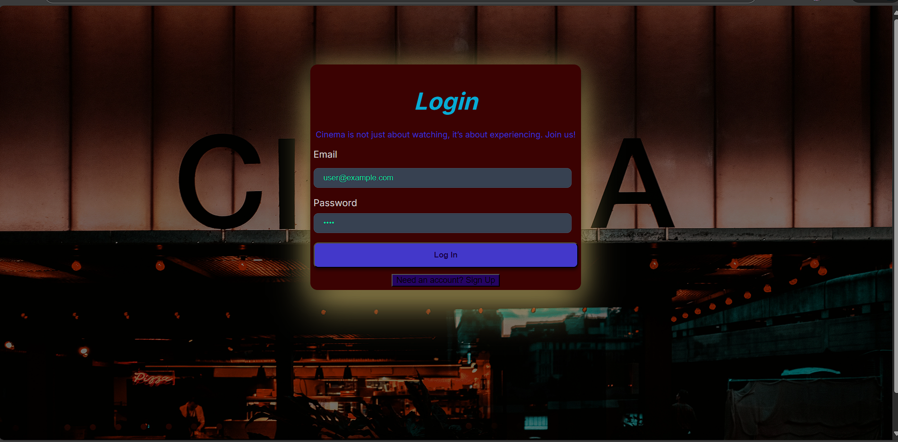
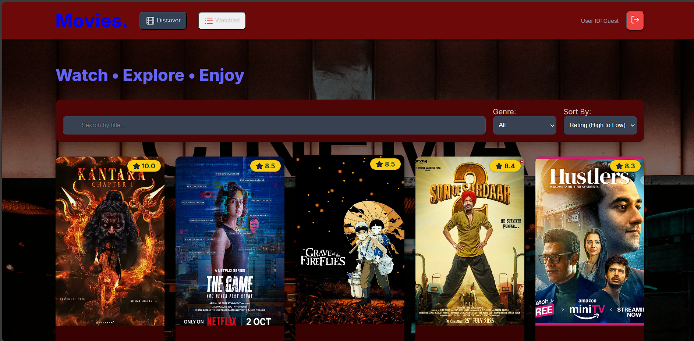

# Movies ✍️🤖

Movies is a frontend-only website for Movies/Series/Anime. Users can browse, filter, sort, view details, and manage a personal watchlist.

## 🚀 Features

-Browse movies/series/anime list
-Filter by genre
-Sort by rating
-Modal for detailed info
-Responsive design (mobile + desktop)
-Error / 404 page

## 📂 Project Structure
📦 Movies
 ┣ 📂 index.html(HTML + SCRIPT)
 ┣ 📂 styles
 ┣ 📜 README.md

## 🛠️ Technologies Used
- HTML  
- CSS  
- JavaScript

## 🔧 How to Run
1. Clone the repo:
   \`\`\`bash
   git clone  https://github.com/Vinaygkp/Movies.git
   \`\`\`
2. Open index.html in your browser.  

## 📸 Screenshots
### login page ### Home page

### Home page
 (home2.png/)(home3.png/)

## 📌 Future Improvements
- Add backend 
- User authentication  
- Add more movies 

---

✨ Design by ❤️ vinay" > README.md
